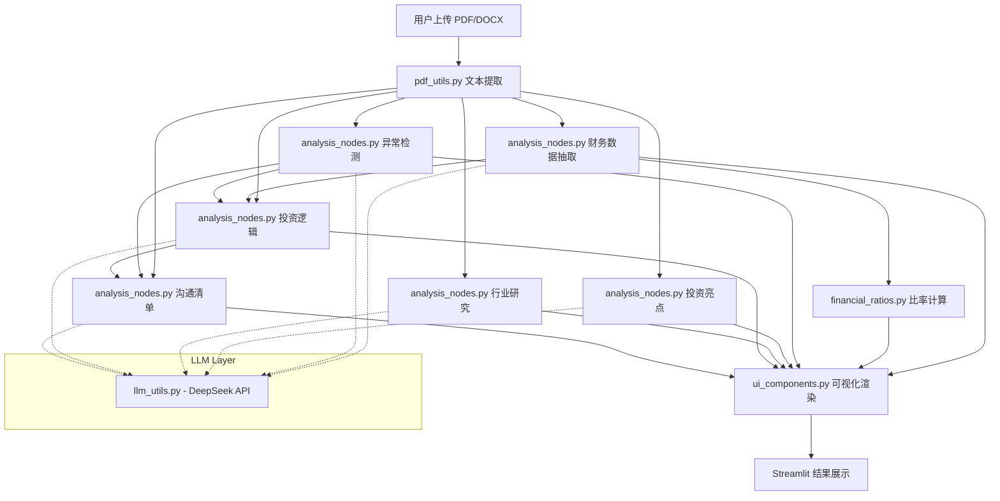

# VestMind — 硬科技 AI 投研助手

[](https://www.python.org/)
[](https://streamlit.io/)
[](LICENSE)

> **Smart Mind for Sound *Investment***
> 聚焦半导体、新能源、高端制造 · 7 维投资逻辑框架

VestMind 是一款基于大语言模型的 AI 投研助手，上传一份硬科技公司的尽调报告（PDF/DOCX），即可自动生成涵盖财务透视、异常检测、行业研究、投资逻辑、沟通清单等六大维度的深度分析报告。

<p align="center">
  
  
  
  
</p>

---

## ✨ 功能特性

| 模块                   | 说明                                                                       |
| ---------------------- | -------------------------------------------------------------------------- |
| 📊**财务透视**   | 自动提取三年核心财务数据，计算 15+ 项财务比率，生成雷达图与趋势图          |
| ⚠️**异常标记** | 智能检测现金跑道、利润含金量、收现比、毛利率等关键风险信号                 |
| 💡**投资亮点**   | 基于报告事实提炼 3 个核心投资亮点，附带原文依据                            |
| 🌐**行业研究**   | 产业链定位、市场规模、竞争格局、关键卡点四维度行业分析                     |
| 🧠**投资逻辑**   | 产业周期、技术壁垒、客户价值、团队执行力、TAM、财务模型、退出路径 7 维框架 |
| 💬**沟通清单**   | 生成 5 个优先级排序的尽调沟通要点，覆盖技术、市场、财务、团队、运营、融资  |

---

## 🚀 快速开始

### 网页预览
https://diligence-pilot.streamlit.app/  
上传报告即可开始分析

### 前提条件

- Python 3.9+
- DeepSeek API Key（[获取地址](https://platform.deepseek.com/)）

### 本地运行

```bash
# 1. 克隆仓库
git clone https://github.com/laubanite/diligence-pilot.git
cd diligence-pilot

# 2. 安装依赖
pip install -r requirements.txt

# 3. 配置 API Key

# 方式 A：使用 .env 文件（本地开发）
echo 'LLM_API_KEY=sk-your-deepseek-api-key' > .env

# 方式 B：使用 Streamlit Secrets（推荐用于部署）
mkdir -p .streamlit
cat > .streamlit/secrets.toml << EOF
LLM_API_KEY = "sk-your-deepseek-api-key"
# LLM_BASE_URL = "https://api.deepseek.com"   # 可选，此为默认值
# LLM_MODEL = "deepseek-v4-flash"             # 可选，此为默认值
EOF

# 4. 启动应用
streamlit run app.py
```

打开浏览器访问 `http://localhost:8501`，上传一份尽调报告 PDF 即可开始分析。

---

## ☁️ Streamlit Cloud 部署

1. 将代码推送到 GitHub 仓库
2. 在 [Streamlit Cloud](https://streamlit.io/cloud) 中关联该仓库
3. 在应用的 **Settings → Secrets** 中添加：

```toml
LLM_API_KEY = "sk-your-deepseek-api-key"
```

应用会自动从 `st.secrets` 读取 API Key，无需修改任何代码。

---

## 📁 项目结构

```
diligence-pilot/
├── app.py                  # 主入口：页面路由、UI 布局、交互逻辑
├── config.py               # 配置常量：配色、阈值规则、Tab 名称
├── llm_utils.py            # LLM 调用封装：支持 st.secrets / 环境变量
├── pdf_utils.py            # 文档解析：PDF (PyMuPDF) + DOCX (python-docx)
├── analysis_nodes.py       # 6 个 LLM 分析节点：财务提取、异常、亮点、行业、逻辑、沟通
├── financial_ratios.py     # 财务比率计算引擎：15+ 项指标，含除零保护
├── ui_components.py        # UI 渲染组件：图表、表格、雷达图、告警着色
├── test_extract.py         # 本地离线测试脚本
├── requirements.txt        # Python 依赖
└── README.md
```

---

## 🏗️ 架构设计



---

## 🔧 配置说明

| 配置项           | 说明                                | 默认值                       |
| ---------------- | ----------------------------------- | ---------------------------- |
| `LLM_API_KEY`  | DeepSeek API 密钥（**必填**） | -                            |
| `LLM_BASE_URL` | API 端点地址                        | `https://api.deepseek.com` |
| `LLM_MODEL`    | 模型名称                            | `deepseek-v4-flash`        |

配置优先级：**Streamlit Secrets > 环境变量 > 默认值**

本地开发可在 `.env` 文件或 `.streamlit/secrets.toml` 中配置；部署到 Streamlit Cloud 时只需在 Secrets 面板中填入 `LLM_API_KEY`。

---

## 📊 财务指标覆盖

系统自动计算以下 15+ 项财务比率，并与预设健康阈值对比，异常值红色高亮：

- **生存与现金流**：现金跑道（月）、利润含金量、收现比
- **盈利质量**：毛利率及趋势、扣非净利润占比、研发费用率、EBITDA 利润率
- **运营效率**：应收账款周转天数、存货周转天数、资产周转率
- **偿债与资本**：有息资产负债率、流动比率、净营运资本变动率、股权稀释率

---

## 🤝 贡献

欢迎提交 Issue 和 Pull Request。如有疑问，请通过 GitHub Issues 联系。

---

## 📄 许可证

本项目基于 MIT 许可证开源。详见 [LICENSE](LICENSE) 文件。

---

<p align="center">
  <sub>Built with ❤️ for hard-tech investors</sub>
</p>
